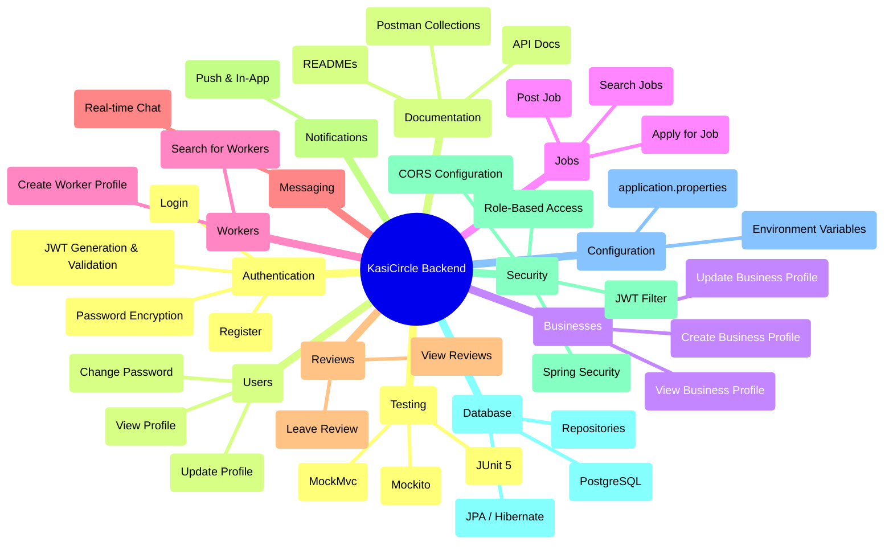
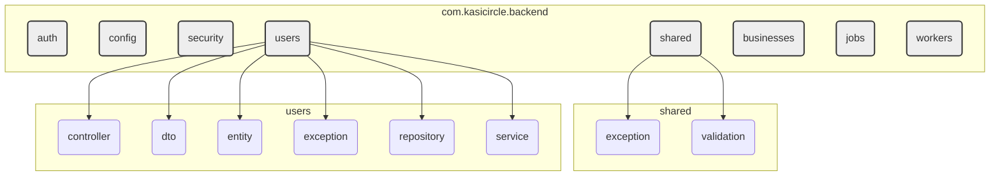
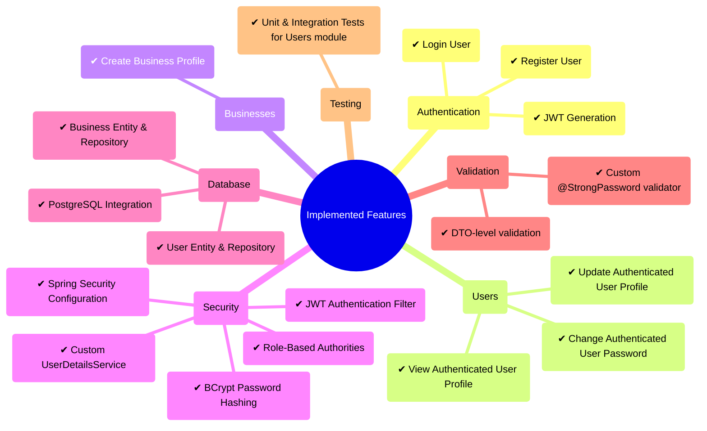
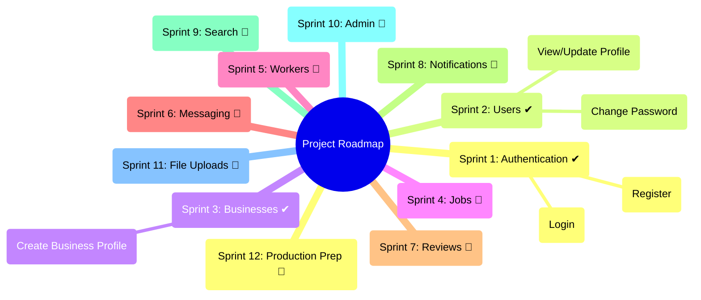
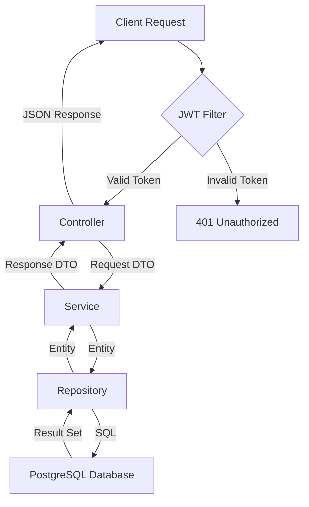
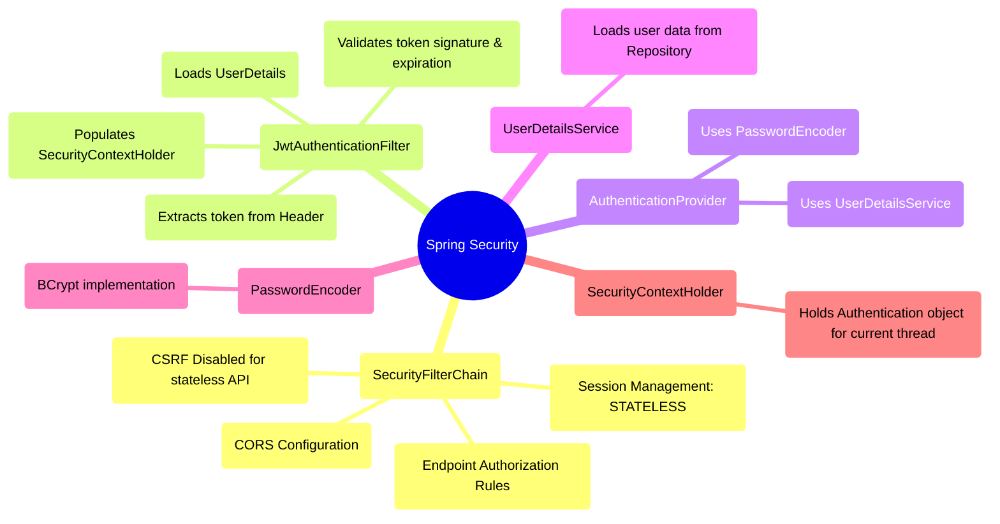

# KasiCircle Backend Architecture

This document provides a comprehensive visual overview of the KasiCircle backend architecture, request flows, and project roadmap using Mermaid diagrams. It is intended to help developers quickly understand the system's design and components.

## Table of Contents
1.  [High-Level Architecture](#1-high-level-architecture)
2.  [Package Structure](#2-package-structure)
3.  [Implemented Features](#3-implemented-features)
4.  [Project Sprint Roadmap](#4-project-sprint-roadmap)
5.  [Typical Request Flow](#5-typical-request-flow)
6.  [Authentication Flow](#6-authentication-flow)
7.  [Security Architecture](#7-security-architecture)
8.  [Database Relationships](#8-database-relationships)

---

## 1. High-Level Architecture

This mind map shows the major functional and technical components of the KasiCircle backend.



---

## 2. Package Structure

The project follows a feature-oriented package structure to promote modularity and separation of concerns.



---

## 3. Implemented Features

This diagram tracks the features that are complete and integrated into the application.



---

## 4. Project Sprint Roadmap

This roadmap outlines completed and planned work, organized by sprints.



---

## 5. Typical Request Flow

This flowchart illustrates the journey of an API request through the application's layers.



---

## 6. Authentication Flow

This diagram details the two primary authentication processes: user registration and login.

```mermaid
graph TD
    subgraph Registration
        A[1. Client sends Register Request] --> B{2. Validate DTO};
        B -- Valid --> C[3. Encrypt Password with BCrypt];
        C --> D[4. Save User to Database];
        D --> E[5. Generate JWT];
        E --> F[6. Return JWT to Client];
        B -- Invalid --> G[400 Bad Request];
    end

    subgraph Login & Authenticated Request
        H[1. Client sends Login Request] --> I{2. Validate Credentials};
        I -- Valid --> J[3. Generate JWT];
        J --> K[4. Client stores JWT];
        K --> L[5. Client sends request with 'Authorization: Bearer JWT'];
        L --> M[6. JwtAuthenticationFilter validates token];
        M --> N[7. SecurityContext is populated];
        N --> O[8. Controller action is executed];
    end
```



---

## 7. Security Architecture

This mind map breaks down the key components of the Spring Security implementation.



---

## 8. Database Relationships

This diagram shows the relationships between the core database entities.

```mermaid
mindmap
  root((Entities))
    (User)
      (owns) --> (Business)
      (creates) --> (Job)
      (is a) --> (Worker)
      (sends/receives) --> (Message)
      (writes/receives) --> (Review)
    (Business)
      (posts) --> (Job)
      (receives) --> (Review)
    (Job)
      (has) --> (Application 🚧)
    (Worker)
      (receives) --> (Review)

    style User fill:#f9f,stroke:#333,stroke-width:2px
    style Business fill:#ccf,stroke:#333,stroke-width:2px
    style Job fill:#cfc,stroke:#333,stroke-width:2px
    style Worker fill:#ffc,stroke:#333,stroke-width:2px
    style Message fill:#eee,stroke:#333,stroke-width:2px
    style Review fill:#eee,stroke:#333,stroke-width:2px
    style Application fill:#eee,stroke:#333,stroke-width:2px
```